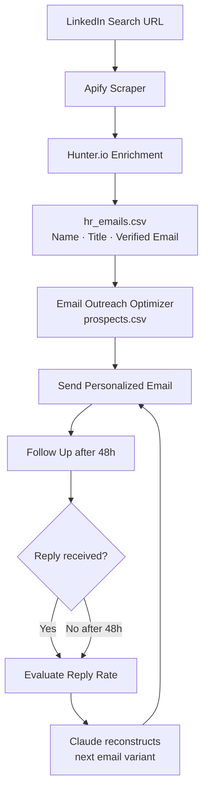
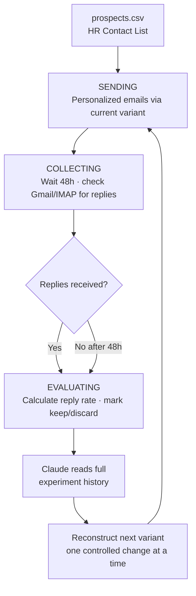

# AI Job Application System

An end-to-end AI-powered job application system built in two parts:

1. **Job Application Agent** — finds HR contacts at target companies using LinkedIn, Apify, and Hunter.io
2. **Email Outreach Optimizer** — sends personalized emails to those contacts, follows up automatically, tracks replies, and uses Claude to reconstruct better email variants based on reply rate

Built while studying at NUS to automate my own job search using AI tools across scraping, enrichment, and outreach.

---

## Inspiration — Karpathy's Autoresearch

The Email Outreach Optimizer is directly modelled on [Andrej Karpathy's autoresearch framework](https://github.com/karpathy/autoresearch), which autonomously iterates on neural network architecture to minimize validation loss.

The same loop applies to cold email copy — instead of a GPU minimizing loss, **Claude minimizes poor reply rate** by iterating on email variants one controlled change at a time:

| Autoresearch | Email Outreach Optimizer |
|---|---|
| Model architecture | Email variant (subject + body + CTA) |
| Training run (~5 min) | Email batch + 48-hour reply window |
| Validation loss (lower = better) | Reply rate (higher = better) |
| One architecture change per run | One copy change per run (subject / opener / CTA) |
| GPU compute budget | Prospect list budget |
| Next hypothesis via search | Next hypothesis via Claude |
| `results.tsv` experiment log | `results.tsv` experiment log |

---

## How the Two Parts Connect



---

## Part 1 — Job Application Agent

Finds verified HR email addresses at target companies using LinkedIn search, Apify scraping, and Hunter.io enrichment.

### What It Does

| Step | Tool | Output |
|------|------|--------|
| **1. Search** | LinkedIn People/Jobs Search URL | Target profiles and companies |
| **2. Scrape** | Apify (`powerai/linkedin-peoples-search-scraper`) | Names, titles, LinkedIn URLs |
| **3. Enrich** | Hunter.io domain search (HR department filter) | Verified HR email addresses |
| **4. Export** | `hr_emails.csv` | Ready-to-use contact list |

### Usage

```bash
# Scrape HR contacts from a LinkedIn people search URL
python3 job-application-agent/scrapers/scrape_ncs_hr.py

# Scrape LinkedIn jobs, score against resume, enrich with HR emails
python3 job-application-agent/scrapers/linkedin_scraper.py
python3 job-application-agent/scrapers/find_hr_emails.py

# Preview generated emails before sending
python3 job-application-agent/utils/preview.py
python3 job-application-agent/utils/preview_followup.py

# Run the outreach engine
python3 job-application-agent/engine.py

# Dashboard + reply checker
python3 job-application-agent/orchestrator.py
python3 job-application-agent/orchestrator.py --check
python3 job-application-agent/orchestrator.py --mark-replied job_007
```

---

## Part 2 — Email Outreach Optimizer

Sends personalized emails to HR contacts, follows up, evaluates reply rate, and uses Claude to reconstruct the next email variant — inspired by [Andrej Karpathy's autoresearch](https://github.com/karpathy/autoresearch).

### What It Does



### The Karpathy Analogy

| Autoresearch | Email Outreach Optimizer |
|---|---|
| Model architecture | Email variant (subject + body + CTA) |
| Training run (~5 min) | Email batch + 48-hour reply window |
| Validation loss (lower = better) | Reply rate (higher = better) |
| One architecture change per run | One copy change per run |
| Next hypothesis via search | Next hypothesis via Claude |

### GitHub Actions Automation

Runs every hour on GitHub Actions — fully unattended:

```
.github/workflows/optimize.yml  →  python engine.py  (every hour)
```

Each run executes the current phase, then commits updated `state.json` and `variants.json` back to the repo automatically.

### Usage

```bash
python3 email-outreach-optimizer/engine.py        # run one cycle
python3 email-outreach-optimizer/orchestrator.py  # dashboard
python3 email-outreach-optimizer/utils/demo.py    # dry-run demo, no emails sent
```

---

## Setup

### 1. Install dependencies

```bash
pip install -r job-application-agent/requirements.txt
pip install -e email-outreach-optimizer/
```

### 2. Configure `.env`

```env
# Scraping
APIFY_API_KEY=apify_api_...
LINKEDIN_COOKIE=AQE...         # li_at cookie from browser (F12 → Application → Cookies)
hunter_api_key=...

# OpenAI — job scoring + cover letter generation
OPENAI_API_KEY=sk-...

# Gmail — sending applications
SENDER_EMAIL=you@gmail.com
GMAIL_APP_PASSWORD=xxxx xxxx xxxx xxxx

# Email Outreach Optimizer
EMAIL_PROVIDER=smtp
SENDER_NAME=Your Name
SENDER_TITLE=Your Title
SENDER_COMPANY=Your Company
SMTP_HOST=smtp.gmail.com
SMTP_PORT=587
SMTP_USER=you@gmail.com
SMTP_PASSWORD=xxxx xxxx xxxx xxxx
IMAP_HOST=imap.gmail.com
IMAP_USER=you@gmail.com
IMAP_PASSWORD=xxxx xxxx xxxx xxxx

# Claude — variant reconstruction
ANTHROPIC_API_KEY=sk-ant-...
```

### 3. Configure `job-application-agent/config.json`

```json
{
  "applicant_name": "Your Name",
  "resume_path": "/absolute/path/to/resume.pdf",
  "sender_email": "you@gmail.com",
  "contact_line": "+XX XXXXXXXX | you@gmail.com",
  "batch_size": 20,
  "follow_up_delay_days": 3,
  "eval_window_days": 5
}
```

---

## Full Repository Structure

```
/
├── README.md
│
├── job-application-agent/               # Part 1 — HR contact discovery
│   ├── requirements.txt
│   ├── config.json                      # Name, resume path, batch size, contact line
│   ├── variants.json                    # Active email variant template
│   ├── .env.example
│   │
│   ├── engine.py                        # Outreach state machine — run daily
│   ├── orchestrator.py                  # Dashboard + Gmail reply checker
│   │
│   ├── core/                            # Email generation & sending
│   │   ├── cover_letter.py              # AI cover letter generator (OpenAI GPT-4o)
│   │   ├── email_client.py              # Gmail sender (SMTP + attachment)
│   │   └── generate_variant.py          # A/B variant generator (OpenAI)
│   │
│   ├── scrapers/                        # LinkedIn scraping & HR enrichment
│   │   ├── linkedin_scraper.py          # LinkedIn jobs via Apify → score vs resume
│   │   ├── scrape_ncs_hr.py             # LinkedIn people search → Apify → Hunter.io
│   │   ├── find_hr_emails.py            # Bulk Hunter.io enrichment
│   │   ├── score_and_enrich.py          # Score + attach HR emails
│   │   ├── scraper.py                   # Base Apify scraper
│   │   └── scrape_only.py               # Scrape without scoring
│   │
│   └── utils/                           # Dev tools
│       ├── preview.py                   # Preview cover letters (no send)
│       ├── preview_followup.py          # Preview follow-up emails (no send)
│       └── gmail_mcp_helper.py          # Gmail MCP integration helper
│
└── email-outreach-optimizer/            # Part 2 — Automated sending & self-improvement
    ├── pyproject.toml
    ├── variants.json                    # Active email variant (subject + body + CTA)
    ├── .env.example
    ├── .github/
    │   └── workflows/
    │       └── optimize.yml             # GitHub Actions cron — runs hourly
    │
    ├── engine.py                        # State machine — SENDING → COLLECTING → EVALUATING
    ├── orchestrator.py                  # Dashboard + run logging
    │
    ├── core/
    │   ├── email_client.py              # Send/receive abstraction (SMTP / SendGrid / IMAP)
    │   └── generate_variant.py         # Claude-powered variant reconstructor
    │
    └── utils/
        └── demo.py                      # Dry-run demo — full loop, no emails sent
```

**Local-only (gitignored):**

```
job-application-agent/
├── jobs.csv                             # Pipeline — every job and its status
├── state.json                           # Current phase + timestamps
├── results.tsv                          # A/B test history
└── job_descriptions/                    # Full JD text per job

email-outreach-optimizer/
├── prospects.csv                        # HR contact list (fed from Part 1)
├── state.json                           # Current experiment phase
└── results.tsv                          # Full experiment history
```

---

## Job Application Statuses

| Status | Meaning |
|--------|---------|
| `pending` | Queued, not yet sent |
| `sent` | Application sent, awaiting follow-up |
| `followed_up` | Follow-up sent, waiting for reply |
| `replied` | HR replied |
| `no_response` | No reply after follow-up + 5 days |
| `bounced` | Email address invalid |
| `rejected` | Explicit rejection |

---

## Reply Rate Benchmarks

| Rate | Signal |
|------|--------|
| < 5% | Poor — Claude tries a fundamentally different approach |
| 5–10% | Average — Claude makes small targeted changes |
| 10–20% | Strong — Claude keeps the core, tests one variable |
| > 20% | Exceptional |
