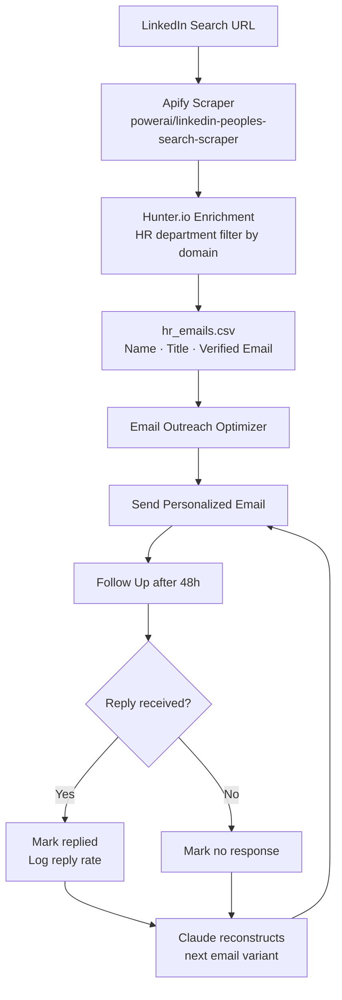

# Job Application Agent

Finds HR contacts at target companies using LinkedIn, Apify, and Hunter.io — then passes the enriched contact list to the Email Outreach Optimizer to send personalized applications and follow-ups.

Built while studying at NUS to automate my own job search using AI tools across scraping, enrichment, and outreach.

---

## What It Does

```
LinkedIn Search → Apify Scrape → Hunter.io Enrichment → HR Contact List
```

| Step | Tool | Output |
|------|------|--------|
| **1. Search** | LinkedIn People/Jobs Search URL | List of target profiles and companies |
| **2. Scrape** | Apify (`powerai/linkedin-peoples-search-scraper`) | Names, titles, LinkedIn URLs |
| **3. Enrich** | Hunter.io domain search (HR department filter) | Verified HR email addresses |
| **4. Export** | `hr_emails.csv` / `ncs_hr_contacts.csv` | Ready-to-use contact list for outreach |

The enriched contact list feeds directly into the **Email Outreach Optimizer** for automated sending, follow-ups, and reply tracking.

---

## Pipeline Overview



---

## Tools Used

| Tool | Purpose |
|------|---------|
| **LinkedIn** | Source of HR/hiring manager profiles |
| **Apify** | Scrapes LinkedIn search results (bypasses auth wall) |
| **Hunter.io** | Enriches company domains → verified HR email addresses |
| **OpenAI GPT-4o** | Scores job-resume fit (1–10) to filter relevant roles |

---

## Setup

### 1. Install dependencies

```bash
pip install -r requirements.txt
```

### 2. Configure `.env`

```env
APIFY_API_KEY=apify_api_...
hunter_api_key=...
LINKEDIN_COOKIE=AQE...        # li_at cookie from your browser (F12 → Application → Cookies)
OPENAI_API_KEY=sk-...
SENDER_EMAIL=you@gmail.com
GMAIL_APP_PASSWORD=xxxx xxxx xxxx xxxx
```

**LinkedIn Cookie:** Open LinkedIn in Chrome → F12 → Application → Cookies → copy `li_at` value.  
**Gmail App Password:** myaccount.google.com → Security → 2-Step Verification → App Passwords.

### 3. Configure `config.json`

```json
{
  "applicant_name": "Your Name",
  "resume_path": "/absolute/path/to/resume.pdf",
  "sender_email": "you@gmail.com",
  "contact_line": "+XX XXXXXXXX | you@gmail.com",
  "batch_size": 20,
  "follow_up_delay_days": 3,
  "eval_window_days": 5
}
```

---

## Usage

### Step 1 — Scrape HR contacts from a LinkedIn people search

Paste any LinkedIn people search URL into `scrape_ncs_hr.py` and run:

```bash
python3 scrapers/scrape_ncs_hr.py
```

Output: `ncs_hr_contacts.csv` with names, titles, LinkedIn URLs, and enriched emails.

### Step 2 — Scrape LinkedIn jobs and find HR emails (bulk)

```bash
python3 scrapers/linkedin_scraper.py   # scrape jobs → score against resume → save to jobs.csv
python3 scrapers/find_hr_emails.py     # enrich all companies in scraped_jobs.csv via Hunter.io
```

### Step 3 — Preview emails before sending

```bash
python3 utils/preview.py              # preview generated cover letter
python3 utils/preview_followup.py     # preview follow-up email
```

### Step 4 — Run the outreach engine

Once the contact list is ready, the Email Outreach Optimizer takes over:

```bash
# Pass hr_emails.csv to the Email Outreach Optimizer as prospects.csv
python3 engine.py                     # send, follow up, evaluate
python3 orchestrator.py               # view dashboard
python3 orchestrator.py --check       # scan Gmail for replies
python3 orchestrator.py --mark-replied job_007
```

---

## File Structure

```
job-application-agent/
├── README.md
├── requirements.txt
├── config.json                      # Your name, resume path, batch size, contact line
├── variants.json                    # Active email variant (tone, structure, CTA)
├── .env.example
├── .gitignore
│
├── engine.py                        # Outreach state machine — run daily
├── orchestrator.py                  # Dashboard + Gmail reply checker
│
├── core/                            # Email generation & sending
│   ├── cover_letter.py              # AI cover letter generator (OpenAI GPT-4o)
│   ├── email_client.py              # Gmail sender (SMTP + attachment)
│   └── generate_variant.py          # A/B variant generator (OpenAI)
│
├── scrapers/                        # LinkedIn scraping & HR email enrichment
│   ├── linkedin_scraper.py          # LinkedIn job search via Apify → score vs resume
│   ├── scrape_ncs_hr.py             # LinkedIn people search → Apify → Hunter.io
│   ├── find_hr_emails.py            # Bulk Hunter.io enrichment for all scraped companies
│   ├── score_and_enrich.py          # Score scraped jobs + attach HR emails
│   ├── scraper.py                   # Base Apify scraper
│   └── scrape_only.py               # Scrape without scoring
│
└── utils/                           # Dev tools
    ├── preview.py                   # Preview cover letters in terminal (no send)
    ├── preview_followup.py          # Preview follow-up emails in terminal (no send)
    └── gmail_mcp_helper.py          # Gmail MCP integration helper
```

**Local-only (gitignored):**

```
├── jobs.csv                         # Full pipeline — every job and its status
├── state.json                       # Current phase + timestamps
├── results.tsv                      # A/B test history (variant → reply rate)
└── job_descriptions/                # Full JD text per job (job_001.txt, ...)
```

---

## Output Files

| File | Contents |
|------|---------|
| `hr_emails.csv` | Enriched HR contacts for all scraped companies |
| `ncs_hr_contacts.csv` | HR contacts for a specific company search |
| `jobs.csv` | Tracked job applications with status, timestamps, reply flags |
| `scraped_jobs.csv` | Raw Apify scrape output before scoring |
| `matched_jobs.csv` | Scored and filtered jobs (score ≥ threshold) |

---

## Job Statuses

| Status | Meaning |
|--------|---------|
| `pending` | Queued, not yet sent |
| `sent` | Application sent, awaiting follow-up window |
| `followed_up` | Follow-up sent, waiting for reply |
| `replied` | HR replied |
| `no_response` | No reply after follow-up + 5 days |
| `bounced` | Email address invalid |
| `rejected` | Explicit rejection |

---

## Related Project

The HR contact list produced here feeds directly into the **[Email Outreach Optimizer](../Email-outreach-optimizer)** — which handles sending, follow-ups, reply tracking, and self-improving email variants.
