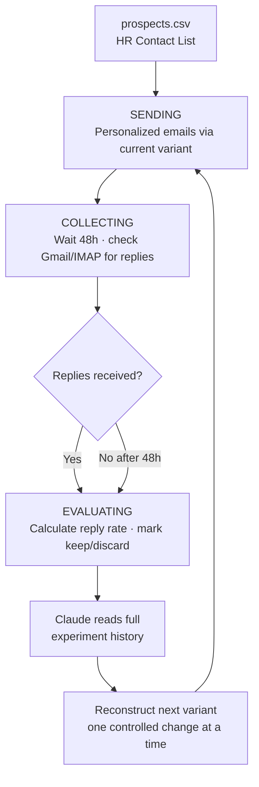

# Email Outreach Optimizer

Sends personalized emails to HR contacts, follows up automatically, tracks replies, and uses Claude to reconstruct a better email variant based on reply rate — running the entire loop on GitHub Actions with no manual intervention.

Inspired by [Andrej Karpathy's autoresearch](https://github.com/karpathy/autoresearch) — instead of a GPU minimizing validation loss, Claude minimizes poor reply rate by iterating on email copy one variable at a time.

---

## What It Does



| Step | What happens |
|------|-------------|
| **1. Send** | Sends personalized emails to HR contacts from `prospects.csv` using the current variant |
| **2. Collect** | Waits 48 hours (or until 10 replies) — checks Gmail/IMAP for incoming replies |
| **3. Evaluate** | Calculates reply rate for the variant, marks it `keep` or `discard` |
| **4. Reconstruct** | Claude reads full experiment history and generates the next email variant — one controlled change at a time |

Each cycle is one experiment. The system converges toward the email copy that actually gets HR to reply.

---

## The Karpathy Analogy

This system is directly modelled on [Andrej Karpathy's autoresearch framework](https://github.com/karpathy/autoresearch), which autonomously iterates on neural network architecture to minimize validation loss.

| Autoresearch | Email Outreach Optimizer |
|---|---|
| Model architecture | Email variant (subject + body + CTA) |
| Training run (~5 min) | Email batch + 48-hour reply window |
| Validation loss (lower = better) | Reply rate (higher = better) |
| One architecture change per run | One copy change per run (subject / opener / CTA) |
| GPU compute budget | Prospect list budget |
| `results.tsv` log | `results.tsv` log |
| Next hypothesis via search | Next hypothesis via Claude |

---

## GitHub Actions Automation

The entire loop runs **every hour on GitHub Actions — fully unattended**:

```
.github/workflows/optimize.yml  →  python engine.py  (every hour)
```

Each run:
1. Reads `state.json` to know the current phase
2. Executes that phase — sends emails / checks for replies / evaluates and reconstructs the variant
3. Commits updated `state.json` and `variants.json` back to the repo automatically

All credentials live in **GitHub repository secrets** — nothing sensitive is stored in the repo.

**Trigger manually:** Actions → Email Outreach Optimizer → Run workflow.

---

## How the Variant Reconstruction Works

After each experiment, Claude receives:
- All past variants and their reply rates
- What changed between each version
- Which changes helped, which didn't

Claude then generates the **next variant with one controlled change** — subject line only, opener only, or CTA only — so each experiment isolates exactly what moved the reply rate.

```
v1 (6% reply rate)  →  Claude: "try shorter body, same subject"
v2 (14% reply rate) →  Claude: "body is working, now test subject line variants"
v3 (...)            →  ...
```

---

## Setup

### 1. Install dependencies

```bash
pip install -e .
```

### 2. Configure `.env` (for local runs)

```bash
cp .env.example .env
```

### 3. Add GitHub Secrets (for Actions automation)

Go to repo → Settings → Secrets and variables → Actions:

| Secret | Value |
|--------|-------|
| `EMAIL_PROVIDER` | `smtp`, `sendgrid` |
| `SENDER_EMAIL` | your sending address |
| `SENDER_NAME` | your name |
| `SENDER_TITLE` | your title |
| `SENDER_COMPANY` | your company |
| `SMTP_HOST` | e.g. `smtp.gmail.com` |
| `SMTP_PORT` | `587` |
| `SMTP_USER` | your Gmail |
| `SMTP_PASSWORD` | Gmail App Password |
| `IMAP_HOST` | `imap.gmail.com` |
| `IMAP_USER` | your Gmail |
| `IMAP_PASSWORD` | Gmail App Password |
| `ANTHROPIC_API_KEY` | Claude API key |

### 4. Add your prospects

Create `prospects.csv` (gitignored — stays local). Typically populated from the **Job Application Agent**:

```csv
email,first_name,company,role,notes
hr@acmecorp.com,Alex,Acme Corp,HR Manager,Hiring for PM roles
```

### 5. Set your first email variant

Edit `variants.json` with your baseline subject and body. Use `{{first_name}}`, `{{company}}`, `{{sender_name}}` as personalization placeholders.

### 6. Set your campaign context

Edit `_build_prompt()` in `core/generate_variant.py` to describe your target audience — this is what Claude uses when reconstructing variants.

---

## Usage

```bash
python engine.py           # run one cycle manually
python orchestrator.py     # view live dashboard
python utils/demo.py       # dry-run demo — no emails sent, shows full loop simulation
```

---

## File Structure

```
Email-outreach-optimizer/
├── README.md
├── pyproject.toml
├── variants.json                    # Active email variant (subject + body + CTA)
├── .env.example
├── .gitignore
├── .github/
│   └── workflows/
│       └── optimize.yml             # GitHub Actions cron — runs engine.py every hour
│
├── engine.py                        # State machine — SENDING → COLLECTING → EVALUATING
├── orchestrator.py                  # Dashboard + run logging
│
├── core/
│   ├── email_client.py              # Send/receive abstraction (SMTP / SendGrid / IMAP)
│   └── generate_variant.py         # Claude-powered variant reconstructor
│
└── utils/
    └── demo.py                      # Dry-run demo — simulates full loop, no emails sent
```

**Local-only (gitignored):**

```
├── prospects.csv                    # HR contact list (from Job Application Agent)
├── state.json                       # Current phase, sent count, reply count
└── results.tsv                      # Full experiment history (variant → reply rate)
```

---

## Variant Format

```json
{
  "variant_id": "v2",
  "description": "shorter body — 62 words, pain-first opener",
  "subject": "quick question about {{company}}",
  "body": "Hi {{first_name}},\n\n...\n\n{{sender_name}}\n{{sender_title}}, {{sender_company}}",
  "personalization_variables": ["first_name", "company", "sender_name", "sender_title", "sender_company"],
  "notes": "v1 at 6% — hypothesis: shorter + pain-first opener will improve rate"
}
```

---

## Reply Rate Benchmarks

| Rate | Signal |
|------|--------|
| < 5% | Poor — Claude will try a fundamentally different approach |
| 5–10% | Average — Claude iterates with small targeted changes |
| 10–20% | Strong — Claude keeps the core, tests one variable |
| > 20% | Exceptional |

---

## Related Project

Prospects come from the **[Job Application Agent](../job-application-agent)** — which scrapes LinkedIn via Apify and enriches HR contact emails via Hunter.io, producing the `hr_emails.csv` that feeds into this optimizer as `prospects.csv`.
